# Project-KaggleCreditCard

# Purpose of this project
- Compare the performance of sampling dataset vs weighting the classes when dealing with imbalanced dataset
  - Analytical objective: maximize Area under Precision-Recall Curve (AUPRC)
  - sklearn's implementation = Average Precision (AP)
- Identify ways to speed up sklearn on a large dataset with 285,000 rows

# Findings 
- class imbalance
  - AP > AUROC
  - 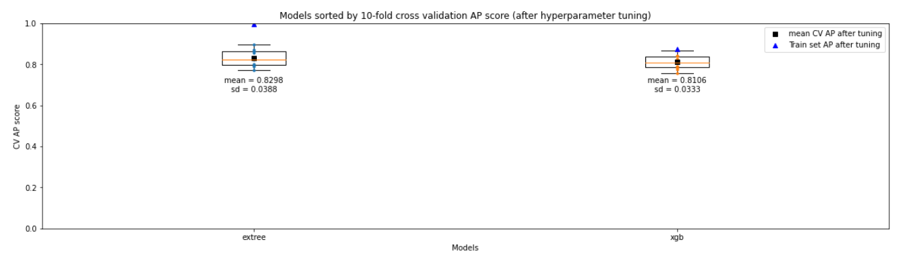
  - 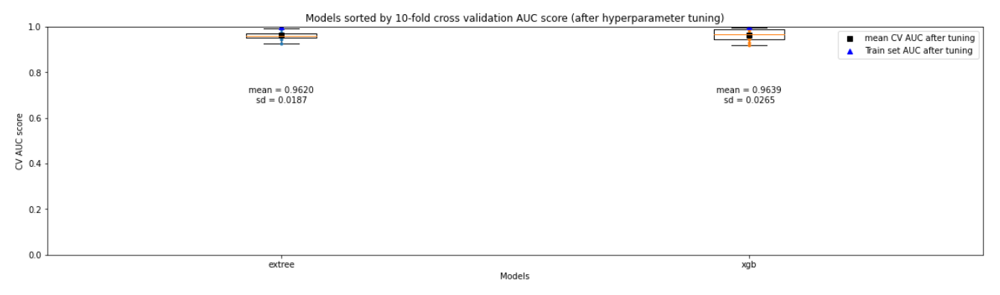
- limitation of balancing class weights
  - cannot use HalvingRandomSearchCV for imbalanced dataset as each epoch might not contain the rare class
- limitation of ADASYN
  - cannot apply sample_weight ("Amount" column)
- Parallel backend of sklearn
  - potential to speed up with spark clusters

----------------------------------

# Data Understanding
- [Kaggle Credit Card Fraud Detection dataset](https://www.kaggle.com/datasets/mlg-ulb/creditcardfraud?resource=download): anonymized transactions made by credit cards in September 2013 by European cardholders
- The dataset is highly imbalanced, with the positive class (frauds) accounting for 0.172% of all transactions
- For confidentiality issues, the original features V1, V2, ... V28 are not provided, and only the results of a PCA transformation are provided
- Time and amount for each transaction are also provided for cost-sensitive learning

# Data Preparation
Since the dataset has been preprocessed with PCA, we don't have to do a lot of preprocessing except feature scaling and can focus on comparing the performance of our models. We will use the following pipelines for each approach.
## Sampling using imblearn's ADASYN
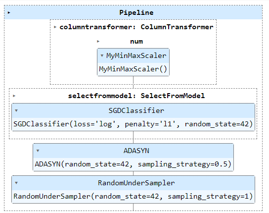
## Weighting the classes
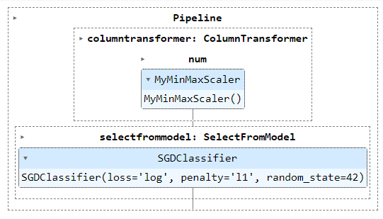

# Modeling
## Shortlist a few models to tune
We first limit our scope to classification models implemented in sklearn with the following properties:
- n_jobs for parallelization given the size of the dataset
- predict_proba() method for applying ensemble methods later on

Based on the below test run on standard hyperparameters, we can further tune the hyperparameters of extra trees classifier and XGBoost classifier to improve the performance of the models.
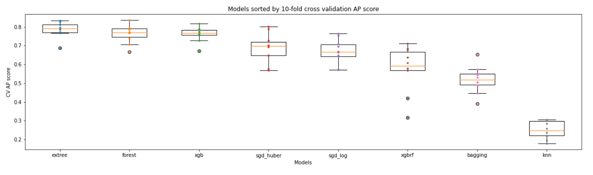

## Tune hyperparameters of the shortlisted models using RandomizedSearchCV

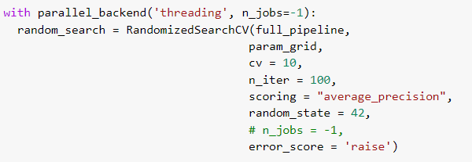

## Apply ensemble learning to improve the performance of the tuned models
- Methods tested: Adaboost, Bagging, Stacking, Voting
- Final model: Adaboost with Extra Trees classifier as the base estimator
- mean 10-fold cross-validation AP: 0.8381 (Adaboost Extra Trees) vs 0.8298 (Extra Trees)

# Evaluation on test set
- Final model = Adaboost Extra Trees Classifier
- 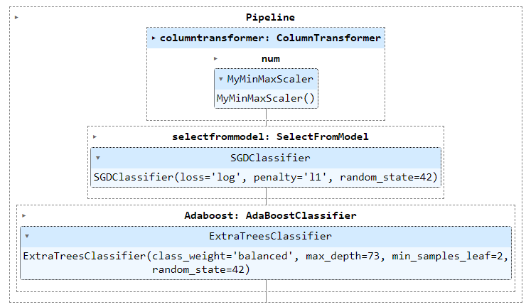

## AP on test set vs CV result
AP on test set = 0.8757
The red dot represents the AP on the test set, while the blue dots represents the AP from 10-fold cross-validation. The model's performance on test set is good and within the range of CV numbers.
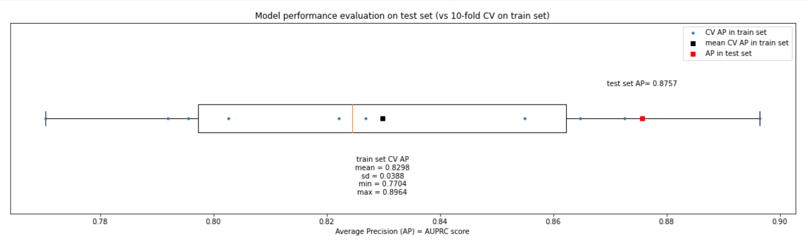
AUROC on test set = 0.9750 (too optimistic)
- 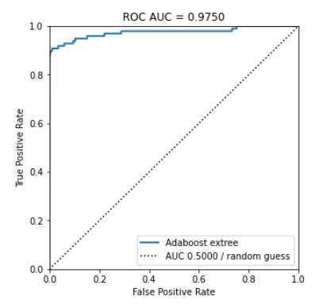

## Lift and gain chart
Lift in 1st decide is more than 9x and we can capture more than 90% of frauds in the first 10% of the train set.
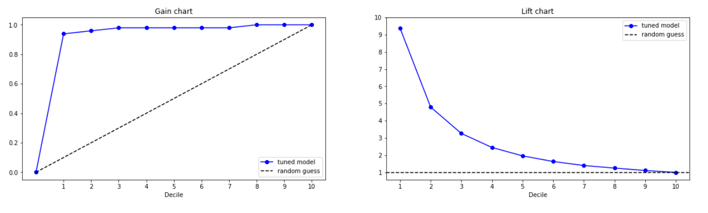

## Precision-Recall Tradeoff
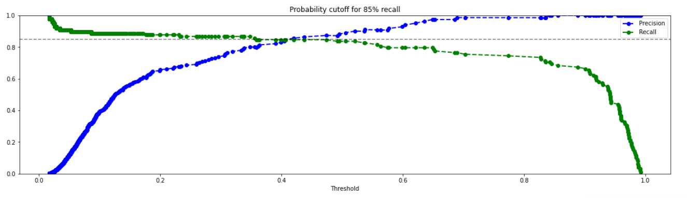
Based on the tradeoff, we can set a cutoff to achieve, for example 85% recall if we prioritize recall over precision as we care about catching more frauds and false alarms are acceptable. The confusion matrix is as below:
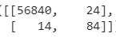 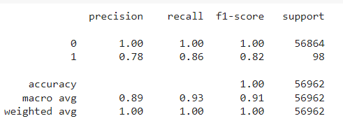

